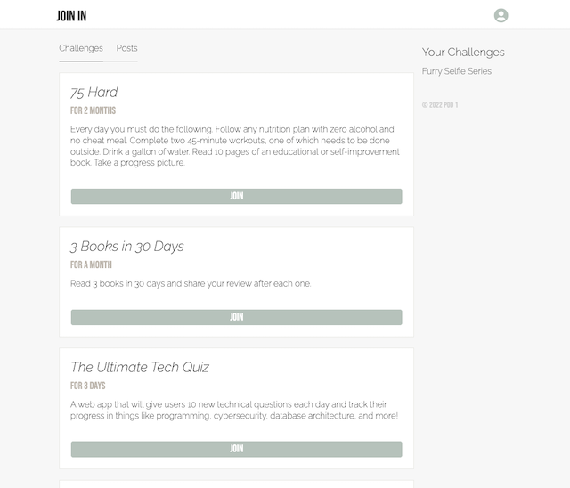

# Join In

Join In is an app where users can challenge themselves and others by creating challenges and joining challenges that others have created!

Upon opening the application, you will be prompted to log in. Every user must be logged in to view the homepage, including challenges.

On the homepage you will see one tab for Challenges and one tab for Posts.

By clicking on the profile icon in the upper righthand corner, you have the option to create a challenge, create a post, go to your profile, or logout.

**Challenges:**

The challenge tab is where you will see challenges posted by all users. Challenges are time sensitive so you will see an expiration letting you know when the challenge ends. You have the option to join a challenge by clicking the "join" button and that challenge will be added to "Your Challenges" on the right side. If you click on a challenge title you will be taken to that challenge page where it will show all posts users have made related to that challenge.

**Posts:**

The posts tab is where you will see progress updates from users on how they are doing on their challenges. Users can post as often as they'd like to communicate with others and keep themselves accountable.

[Link to Deployed Application on Heroku](https://join-in-app.herokuapp.com/login)

